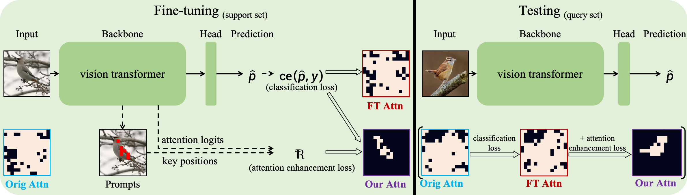

## Focus Your Attention when Few-Shot Classification
PyTorch implementation of
<br>
[**Focus Your Attention when Few-Shot Classification**](https://openreview.net/forum?id=uFlE0qgtRO)
<br>
NeurIPS 2023

<p align="center">
  
</p>

### Abstract

Since many pre-trained vision transformers emerge and provide strong representation for various downstream tasks, we aim to adapt them to few-shot image classification tasks in this work. The input images typically contain multiple entities. The model may not focus on the class-related entities for the current few-shot task, even with fine-tuning on support samples, and the noise information from the class-independent entities harms performance. To this end, we first propose a method that uses the attention and gradient information to automatically locate the positions of key entities in the support images, denoted as \emph{position prompts}. Then we employ the cross-entropy loss between their many-hot presentation and the attention logits to optimize the model to focus its attention on the key entities during fine-tuning. This ability then can generalize to the query samples. Our method is applicable to different vision transformers (e.g., columnar or pyramidal ones), and also to different pre-training ways (e.g., single-modal or vision-language pre-training). Extensive experiments show that our method can improve the performance of full or parameter-efficient fine-tuning methods on few-shot tasks.

### Citation
If you find this project useful in your research, please consider cite:
```
@inproceedings{wang2023focus,
title={Focus Your Attention when Few-Shot Classification},
author={Haoqing Wang and Shibo Jie and Zhi-Hong Deng},
booktitle={Thirty-seventh Conference on Neural Information Processing Systems},
year={2023},
url={https://openreview.net/forum?id=uFlE0qgtRO}
}
```

### Dependencies
* Python >= 3.6
* PyTorch >= 1.7.0 and Torchvision >= 0.8.0
* timm == 0.3.2
* cvxpy >= 1.1.19 && qpth == 0.0.15
* clip == 1.0

### Datasets
We use the benchmark from [CrossDomainFewShot](https://github.com/hytseng0509/CrossDomainFewShot), including CUB, Cars, Places and Plantae datasets, and also use two other fine-gained datasets: [Aircraft](https://www.robots.ox.ac.uk/~vgg/data/fgvc-aircraft/) and [Pets](https://www.robots.ox.ac.uk/~vgg/data/pets/). Please download these datasets and put them to respective paths, e.g., `filelists/cub` or `filelists/pets`, then process them with following commands.
- Set `xxx` to: `cub`, `cars`, `places`, `plantae`, `aircraft` or `pets`.
```
cd filelists/xxx
python write_xxx_filelist.py
```

### Pre-trained model

We use the following pre-trained vision transformers: [DINO_ViT-B/16_IM1K](https://dl.fbaipublicfiles.com/dino/dino_vitbase16_pretrain/dino_vitbase16_pretrain.pth), [iBOT_Swin-T/7_IM1K](https://lf3-nlp-opensource.bytetos.com/obj/nlp-opensource/archive/2022/ibot/swint_7/checkpoint_teacher.pth) and [CLIP_ViT-B/16](https://github.com/openai/CLIP). Please download them and put them on the folder `./Pretrain`. 

### Evaluating

change `--dataset`, `--n_way` and `--n_shot` for different settings, change `--backbone` and `--pretrain` for different backbones and pre-trained models.

1. Machine learning classifier

set `--method` to `NN`, `RR` or `SVM`.
```
python ml_classifier.py --dataset cub --method NN --n_way 20 --n_shot 1
```

2. Inductive meta-solver

set `--method` to `ProtoNet`, `R2D2` or `MetaOptNet`.
```
python meta_solver.py --dataset cub --method ProtoNet --n_way 20 --n_shot 1
```

3. Linear probing

```
python linear_prob.py --dataset cub --ft_epoch 20 --ft_lr 1e-2 --n_way 20 --n_shot 1
```

4. Full or parameter-efficient fine-tuning

For ViT-B/16 pre-trained on ImageNet-1K with DINO:
```
python vpt.py --dataset cub --ft_epoch 10 --ft_lr 1e-2 --n_way 20 --n_shot 1 --reset_head True
python vit_finetune.py --dataset cub --ft_epoch 5 --ft_lr 1e-5 --n_way 20 --n_shot 1 --reset_head True --P 14 --tau 1. --alpha 3e-2
python vit_ssf.py --dataset cub --ft_epoch 10 --ft_lr 5e-3 --n_way 20 --n_shot 1 --reset_head True --P 14 --tau 1. --alpha 1e-1
python vit_lora.py --dataset cub --ft_epoch 10 --ft_lr 5e-3 --n_way 20 --n_shot 1 --reset_head True --P 14 --tau 1. --alpha 5e-1
```
For Swin-T/7 pre-trained on ImageNet-1K with iBOT:
```
python swin_finetune.py --dataset cub --ft_epoch 5 --ft_lr 5e-5 --n_way 20 --n_shot 1 --reset_head True --P 7 --tau 10. --alpha 3e-1
python swin_ssf.py --dataset cub --ft_epoch 10 --ft_lr 5e-3 --n_way 20 --n_shot 1 --reset_head True --P 7 --tau 20. --alpha 5e-1
python swin_lora.py --dataset cub --ft_epoch 10 --ft_lr 5e-3 --n_way 20 --n_shot 1 --reset_head True --P 7 --tau 10. --alpha 3e-1
```
For ViT-B/16 from CLIP:
```
python coop.py --dataset cub --ft_epoch 10 --ft_lr 1e-2 --n_way 20 --n_shot 1
python tip-adapter.py --dataset cub --ft_epoch 10 --ft_lr 5e-3 --n_way 20 --n_shot 1
python plot.py --dataset cub --ft_epoch 10 --ft_lr 5e-3 --n_way 20 --n_shot 1
```

`--reset_head` controls whether to use classifier initialization; set `--alpha` to 0. for base fine-tuning methods.

### Visualization
For the visualization of position prompts, the patches covering 95% attention and full attention maps, please restore the commented-out visualization code and set 'eposide_num = 1' in `vit_finetune.py`, `vit_lora.py` and `vit_ssf.py`, then run the commands like
```
python vit_finetune.py --dataset cub --ft_epoch 5 --ft_lr 1e-5 --n_way 20 --n_shot 1 --reset_head True --P 14 --tau 1. --alpha 3e-2
python vit_finetune.py --dataset pets --ft_epoch 5 --ft_lr 1e-5 --n_way 20 --n_shot 1 --reset_head True --P 14 --tau 10. --alpha 1.

python vit_ssf.py --dataset cub --ft_epoch 10 --ft_lr 5e-3 --n_way 20 --n_shot 1 --reset_head True --P 14 --tau 1. --alpha 1e-1
python vit_ssf.py --dataset pets --ft_epoch 10 --ft_lr 5e-3 --n_way 20 --n_shot 1 --reset_head True --P 14 --tau 1. --alpha 8e-2

python vit_lora.py --dataset cub --ft_epoch 10 --ft_lr 5e-3 --n_way 20 --n_shot 1 --reset_head True --P 14 --tau 1. --alpha 5e-1
python vit_lora.py --dataset pets --ft_epoch 10 --ft_lr 5e-3 --n_way 20 --n_shot 1 --reset_head True --P 14 --tau 1. --alpha 1e-1
```
Here we use the ViT-B/16 pre-trained on ImageNet-1K with DINO for backbone initialization.

### Note
We need single GPU with 32G memory for fine-tuning all models, e.g., Tesla V100-32G.
